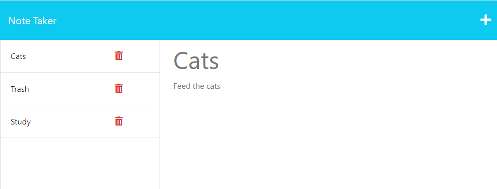

# Nifty Note Taker

## Description
This app keeps track of any notes or a to-do list you have to do for the day.  You can type in the title and description of the notes and then press a save icon for it to be saved to the left hand side of the page.  
If you have multiple tasks, you can click on each task to show the entire desctiption on the right side of the page again.  Once you finish a task, you can delete it by pressing the trashcan icon. 

I was given the front end code for this application and I had to design and code the back end piece.  I used express.js to connect to the client-side servre and back-end server nad Node.js for the file system. I used a uuid to create a function to generate a random number and export it to the server.js to randomly generate an ID# for the notes which allows it to be clicked on again to recall the data and also to delete it later when finished with the note. This application is also deployed on Heroku. 

## Links
- [github repo](https://github.com/erinsawyer504/nifty-note-taker)
- [Nifty Note Taker on Heroku](https://young-sea-74869.herokuapp.com/)

## Table of Contents
- [Installation](#installation)  
- [Usage](#usage)  
- [License](#license)  
- [Constributing](#contributing)  
- [Tests](#tests)  
- [Questions](#questions)

## Installation
Clone the repo into your vs code, install express.js if needed by typing in "npm install express" in the terminal in your vs code. Then to run the application, type "npm start" into the terminal and click on  your localhost:port to open the app in  your browser.  

## Usage
Here is a screenshot that shows how the app runs

## License
This repository is not covered under any license.

## Contributing-
To contribute to this application, just fork the repository!

## Tests
Tests were not used in this application

## Questions
GitHub username: erinsawyer504, 
GitHub profile: (https://www.github.com/erinsawyer504)    
Email address: erinsawyer504@gmail.com  
If you have additional questions, please feel free to email me.

